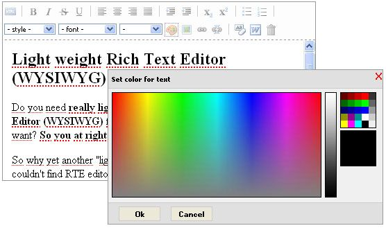

# lwrte
Lightweight Rich Text Editor (RTE / WYSIWYG) for jQuery

## N.B.: Project is not supported anymore. I only imported it from Google Code.</b>




Do you need **really lightweight and unbloated Rich Text Editor (RTE / WYSIWYG) for JQuery** and ability to extend it as you want? **So you at right place.**</p>


Why yet another "lightweight" RTE editor? The major reason - i couldn't find RTE editor:
* without any built-in toolbars (you can turn off controls only, but this's other case),
* really jQuery plugin, but not wrapper (I'm using jQuery in my projects, that's why best choice - real jQuery plugin),
* easy to extend (for example - file uploads).
* **different toolbars** for design mode and source mode

I tried to make this Rich Text Editor as simple as possible to be easily changed according your needs.


The file "jquery.rte.js" is **only 10kb uncompressed**. This has all that your editor probably need, but has no any built-in toolbars - you can extend it easily as you want.


I also provided basic toolbar (**actually it has almost same features as other WYSIWYG editors**), **_include Image/File uploads_** (you will have to configure your server script for uploads or update "uploader.php" from example).


This editor is compatible with major browsers (IE6, Firefox 2, Opera 9, Safari 3.03) and degrade gracefully in a textarea for others.


P.S.: Tested with jQuery 1.2.6 and 1.3

<hr/>

**Usage:**

```javascript
	$('.rte').rte({
		css: [['default.css']],
		controls_rte: rte_toolbar,
		controls_html: html_toolbar
	});
```

OR

```javascript
	$('.rte').rte({
		css: [['default.css']],
		base_url: 'http://mysite.com',
		frame_class: 'frameBody',
		width: 350,
		height: 400,
		controls_rte: rte_toolbar,
		controls_html: html_toolbar
	});
```

**Plugin has no any built-in toolbars, so you have to provide it. Lucky, I created one (with almost any feature that you probably will need, include image uploads and file attachments), so you can use it :)** 


Plugin has only RTE/WYSIWYG editor's API, but no any controls/toobars. In that way you can use own specific version of editor for projects.


Check Wiki for documentation and API.
